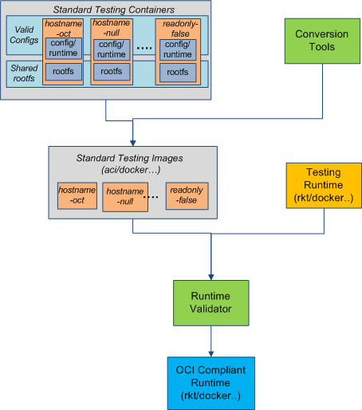

# OCT: Open Container Testing

The OCT project aims to promote the [Open Container Initiative](http://www.opencontainers.org/) by providing a universal open container testing `libs` or `tools`.

## OCT scope
Following [the OCI Principles](https://github.com/opencontainers/specs): 
```
Define a unit of software delivery called a Standard Container. 
The goal of a Standard Container is to encapsulate a software component 
and all its dependencies in a format that is self-describing and portable, 
so that any compliant runtime can run it without extra dependencies, 
regardless of the underlying machine and the contents of the container.
```

OCT covers following areas:
- [Standard Container Test](#standard-container-test) 
- [Compliant Runtime Test](#compliant-runtime-test) 

###Standard Container Test
A standard container should be a [bundle](https://github.com/opencontainers/specs/blob/master/bundle.md) with one standard 'config.json', one standard 'runtime.json' and one standard 'rootfs'.

OCT provides [Bundle Validator](tools/bundleValidator/README.md) to verify if a bundle was a standard container.

###Compliant Runtime Test
OCT provides [Runtime Validator](tools/runtimeValidator/REAME.md) to verify if a runtime was a compliant container.
The `Runtime Validator` is composed of three parts:
  * Standard Testing Containers  
    `Standard Testing Containers` are the standard containers with different configurations in order to cover all the aspects of runtime test.
  * Runtime Validator Program  
    `Runtime Validator Program` runs inside a runtime to verify if settings mentioned in config.json and runtime.json match the relevant system information.
  * Runtime Validator Manager  
    `Runtime Validator Manager` loads all the `Standard Testing Containers`, uses `Runtime Validator Unit` to verify if a runtime runs all the `Standard Testing Containers` correctly.

####Compliant Runtime Testing Flow
There are two types of runtime, the first type support image with OCI format (Standard Container), the second type only support image with other format.
Both of them could be 'OCI compliant', only difference is the second type need a ['conversion'](#conversion-tools) phase.

#####Flow One            


#####Flow Two - begin with `Standard Testing Containers`


###Generator tools
[OCI generator](tools/bundleValidator/README.md) - generate config.json/runtime.json from [Test Case](#test-case)

###Conversion tools
One implementaion of converting from OCI to ACI is hosted at: [oci2aci](https://github.com/huawei-openlab/oci2aci)

###Other tools
To make OCT easier, more tools are required:
- OCI builder - build a native OCI bundle
- [OCI convert](tools/ociConvert) - convert from other images, like rkt.


## Getting Started

- Fork the repository on GitHub
- Read the 'build and test instruction' for [Bundle Validator](tools/bundleValidator/README.md) and [Runtime Validator](tools/runtimeValidator/README.md)
- Play with the project, submit bugs, submit patches!

### How to involve
If any issues are encountered while using the oct project, several avenues are available for support:
<table>
<tr>
	<th align="left">
	Issue Tracker
	</th>
	<td>
	https://github.com/huawei-openlab/oct/issues
	</td>
</tr>
<tr>
	<th align="left">
	Google Groups
	</th>
	<td>
	https://groups.google.com/forum/#!forum/oci-testing
	</td>
</tr>
</table>


## Who should join
- Open Container project developer/user

### Changes
The `engine` part is now moved to [oct-engine](https://github.com/huawei-openlab/oct-engine)
The `cases` part is now moved to [oct-engine/cases](https://github.com/huawei-openlab/oct-engine/cases)
