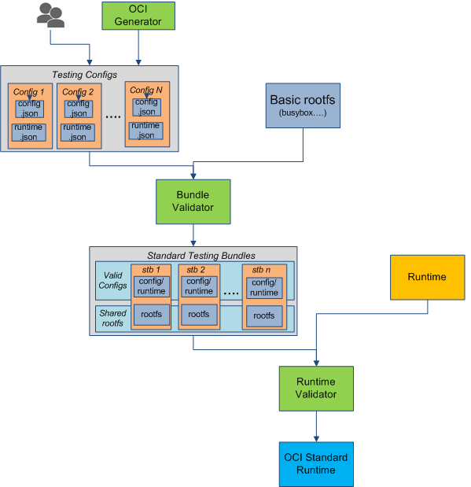
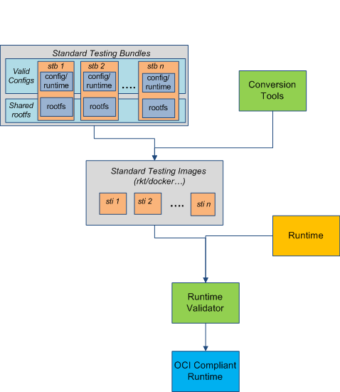

# OCT: Open Container Testing

The OCT project aims to promote the [Open Container Initiative](http://www.opencontainers.org/) by providing a universal open container testing `libs` or `tools`.

## OCT scope
Following [the OCI Principles](https://github.com/opencontainers/specs): 
```
Define a unit of software delivery called a Standard Container. 
The goal of a Standard Container is to encapsulate a software component 
and all its dependencies in a format that is self-describing and portable, 
so that any compliant runtime can run it without extra dependencies, 
regardless of the underlying machine and the contents of the container.
```

OCT covers following areas:
- [Bundle Validator](tools/bundleValidator/README.md) verifies if a bundle was a [Standard OCI Bundle](#standard-bundle).
- [Runtime Validator](tools/runtimeValidator/README.md) verifies if a runtime runs the bundle [correctly](#standard-or-compliant-runtime).

To make OCT easier, more tools are required:
- OCI builder - build a native OCI bundle
- [OCI generator](tools/bundleValidator/README.md) - generate a minimal config.json/runtime.json
- [OCI convert](tools/ociConvert) - convert from other images, like rkt.


###Standard Bundle
A standard OCI bundle should be a [bundle](https://github.com/opencontainers/specs/blob/master/bundle.md) with one standard 'config.json', one standard 'runtime.json' and one standard 'rootfs'.
###Standard Testing Bundles
OCT provides standard bundles with different configuration in order to cover all the OCI testing.

###Standard or Compliant Runtime

####Standard Runtime Testing Flow
A standard OCI runtime should be the one which could run all the [Standard Testing Bundles](#standard-testing-bundles) `correctly`.
`Correctly` means running by a runtime, all the mounts, uid, and other informations should be exactly same with what defined in config.json/runtime.json.


#### Compliant Runtime Testing Flow
A compliant OCI runtime should be the one which could run all its own images [converted](#conversion-tools) from [Standard Testing Bundles](#standard-testing-bundles) `correctly`.



####Conversion tools
One implementaion of converting from OCI to ACI is hosted at: [oci2aci](https://github.com/huawei-openlab/oci2aci)

## Getting Started

- Fork the repository on GitHub
- Read the 'build and test instruction' for [Bundle Validator](tools/bundleValidator/README.md) and [Runtime Validator](tools/runtimeValidator/README.md)
- Play with the project, submit bugs, submit patches!

### How to involve
If any issues are encountered while using the oct project, several avenues are available for support:
<table>
<tr>
	<th align="left">
	Issue Tracker
	</th>
	<td>
	https://github.com/huawei-openlab/oct/issues
	</td>
</tr>
<tr>
	<th align="left">
	Google Groups
	</th>
	<td>
	https://groups.google.com/forum/#!forum/oci-testing
	</td>
</tr>
</table>


## Who should join
- Open Container project developer/user

### Changes
The `engine` part is now moved to [oct-engine](https://github.com/huawei-openlab/oct-engine)
The `cases` part is now moved to [oct-engine/cases](https://github.com/huawei-openlab/oct-engine/cases)
