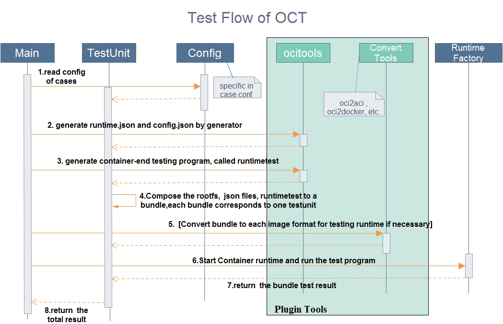

## OCT - OCI Test 
      
The ocitest aims to test if a  container runtime is compliant with [opencontainers/specs](https://github.com/opencontainers/specs),     
It is a light weight testing framework, using ocitools and 3rd-party plugin tools, managing configurable high coverage bundles as cases, supporting testing different runtimes.     


### Summary for the impatient      
***Key note***           
Be sure you have already installed  [golang](http://golang.org/), and the container runtime to be test, such as [runc](https://github.com/opencontainers/runc)  and [rkt](https://github.com/coreos/rkt) .

``` bash   
$ go get github.com/opencontainers/specs              #downland specs of OCI
$ go get github.com/huawei-openlab/oct                 #get source code       
$ cd $GOPATH/src/github.com/huawei-openlab/oct         #change dir to workspace 
$ make                                                 #build      
$ ./ocitest                                            #run     
```     
      

### OCI Test Quickstart       
       
- **Usage**      
       
``` sh      
$ ./ocitest --help
NAME:
   oci-testing - Utilities for OCI Testing,

    It is a light weight testing framework,
    using ocitools and 3rd-party tools, 
    managing configurable high coverage bundles as cases, 
    supporting testing different runtimes.

USAGE:
   ./ocitest [global options] command [command options] [arguments...]
   
VERSION:
   0.0.1
   
COMMANDS:
   help, h	Shows a list of commands or help for one command
   
GLOBAL OPTIONS:
   --runtime, -r "runc"    runtime to be tested, -r=runc or -r=rkt or -r=docker     
   --output, -o "all"   format and content to be ouputed, -o=all: ouput sucessful details and statics, -o=err-only: ouput failure details and statics           
   --debug, -d     switch of debug mode, defaults to false, with '--debug' to enable debug mode     
   --help, -h     show help     
   --generate-bash-completion           
   --version, -v    print the version     
```    
      
- **Supportted runtime**     
      
|Name|Status|
|------|----|------|
| runc | Supported| 
| rkt | Supported |
| docker | Planning|
      
- **Test Flow**  



- **Using Tools**        

Tools used by ocitest as plugins, including:

***Notes**        

*[ocitools](github.com/zenlinTechnofreak/ocitools)
 NOTE:ocitools are foked from [github.com/mrunalp](github.com/mrunalp/ocitools), added some adaptor changes for oct.

*[oci2aci](github.com/huawei-openlab/oci2aci) 

See [plugins/Makefile](./plugins/Makefile)     

- **About Test Cases**        

Cases are listed in [cases.conf](./cases.conf), as the fomate of bunldes, It is going to be rich, in the fomate of below: 
    
```   
process= --args=./runtimetest --args=vp --rootfs=rootfs --terminal=false;--args=./runtimetest --args=vp --rootfs=rootfs --terminal=false     
# result to generate two cases in [bundle](./bundle), should be bundle/process0 and bundle/process1,        
# and '--args=./runtimetest --args=vp --rootfs=rootfs --terminal=false' is params for ocitools generate   
```

### Advantages of OCI Test       
1. Light weight testing freamwork      
2. High coverage test cases, configurable, easy to add cases
3. Tools is used as plugins ,feel free to use any 3rd-paty tools        
4. Uses goroutine, each go routine runs a case bundle to validate   

### Next to Do 

1. Rich cases:        

   Encrease the functionality of ocitools in [cmd/runtimetest](https://github.com/zenlinTechnofreak/ocitools/tree/master/cmd/runtimetest)   
   Rich cases in [cases.conf](./cases.conf)    

2. Support other containers

### Reference
OCI specs on https://github.com/opencontainers/specs   

OCI runc on https://github.com/opencontainers/runc
